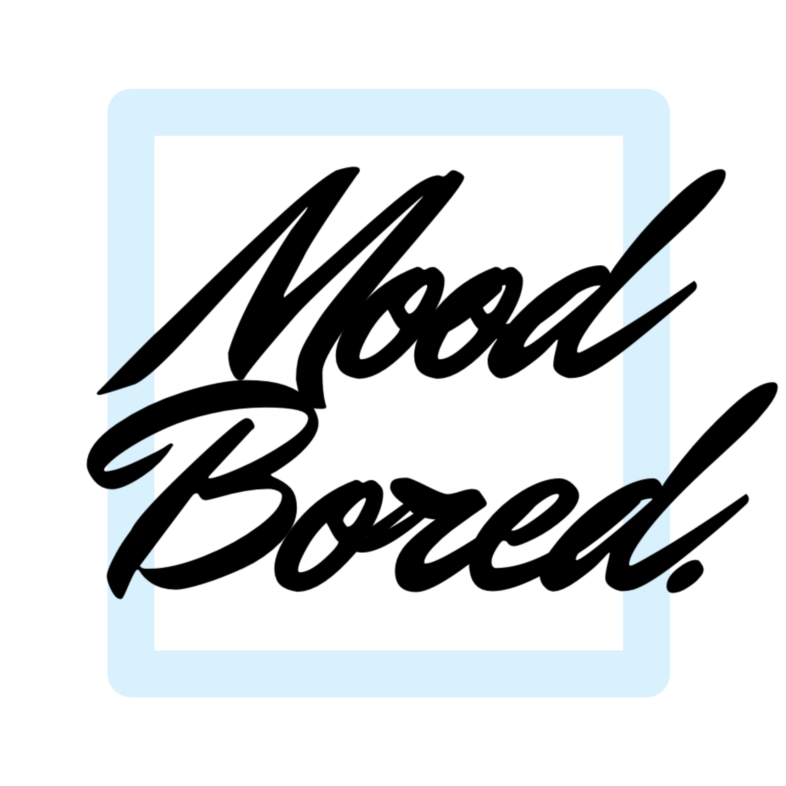
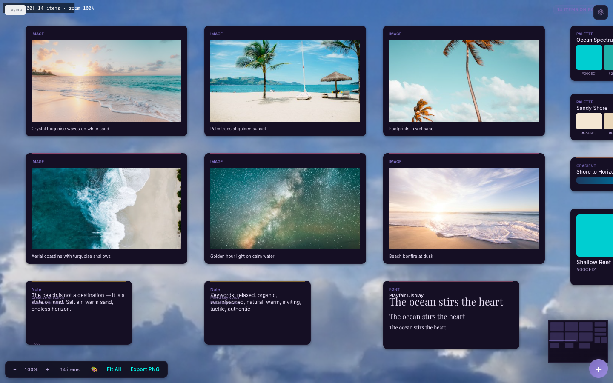
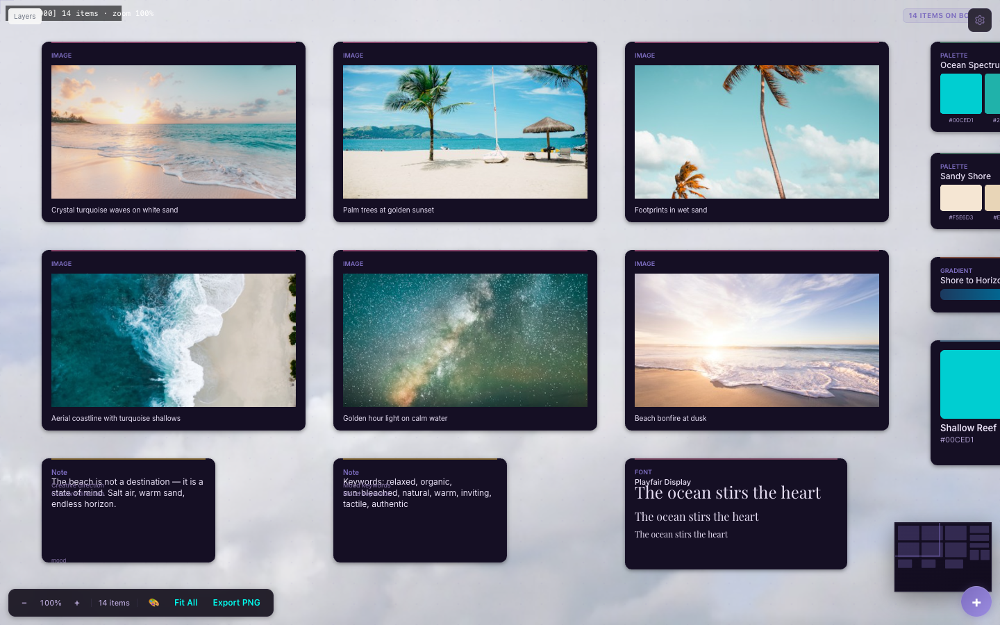
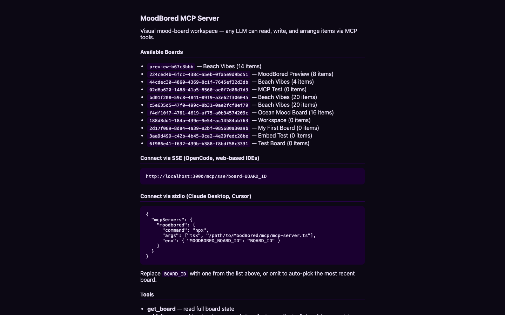

<p align="center">
  
</p>

<h1 align="center">MoodBored</h1>

<p align="center">
  <strong>Visual mood-board workspace where humans and LLMs brainstorm together.</strong><br/>
  <em>Any LLM. Any IDE. One canvas.</em>
</p>

<p align="center">
  <a href="https://moodbored-production.up.railway.app">Live Demo</a> ·
  <a href="#quick-start">Quick Start</a> ·
  <a href="#mcp-integration">MCP</a> ·
  <a href="#features">Features</a> ·
  <a href="#screenshots">Screenshots</a>
</p>

---

## What is MoodBored?

MoodBored is a collaborative canvas for creative direction — mood boards, brand exploration, design systems, and reference gathering. It integrates with any LLM via [MCP](https://modelcontextprotocol.io) so your AI can read, write, and arrange items on the board as naturally as you can.

**No sign-up required.** Works locally, works deployed. One `npm install` and you're running.

## Screenshots

<p align="center">
  <br/>
  <em>Infinite canvas with daylight clouds video background — images, palettes, gradients, fonts, and notes</em>
</p>

<p align="center">
  <br/>
  <em>Dark mode canvas with items populated by AI</em>
</p>

<p align="center">
  <br/>
  <em>MCP connection info page — copy-paste configs for any IDE</em>
</p>

## Quick Start

**Try it live:** [moodbored-production.up.railway.app](https://moodbored-production.up.railway.app)

```bash
git clone https://github.com/xevios-hash/MoodBored.git
cd MoodBored
npm install
npm run dev          # opens at http://localhost:5173
```

**Production server** (serves frontend + MCP endpoints):
```bash
npm run build
npm start            # http://localhost:3000
```

**macOS desktop:**
```bash
npx tauri build      # produces .app + .dmg
```

## MCP Integration

MoodBored exposes an MCP server so any LLM can interact with your board. **7 tools:**

| Tool | What it does |
|------|-------------|
| `get_board` | Read full board state — items, palette, typography |
| `add_items` | Add notes, images, palettes, gradients, fonts, links, videos, containers |
| `remove_items` | Delete items by ID |
| `update_item` | Edit any item's properties |
| `search_items` | Text + tag search across all items |
| `arrange_items` | Grid, horizontal stack, vertical stack, spiral layouts |
| `clear_board` | Wipe all items |

### Claude Desktop / Cursor (stdio)

```json
{
  "mcpServers": {
    "moodbored": {
      "command": "npx",
      "args": ["tsx", "/path/to/MoodBored/mcp/mcp-server.ts"],
      "env": { "MOODBORED_BOARD_ID": "your-board-id" }
    }
  }
}
```

### OpenCode / Web IDEs (SSE)

```
https://moodbored-production.up.railway.app/mcp/sse?board=your-board-id
```

### Connection Info

Open `https://moodbored-production.up.railway.app/mcp` for copy-paste connection configs.

### Discovery

MCP clients can auto-discover the server via `/.well-known/mcp.json`.

## Features

### Canvas
- Infinite pan/zoom with smooth touch gestures
- Lasso selection, alignment snapping, multi-select
- Layers panel, minimap, context menu (all 11 item types)
- Inline text editing on notes (double-click)
- Palette color editing (double-click swatch)
- Eyedropper color picker
- 11 item types: note, text, image, link, palette, gradient, font, swatch, size guide, video, container

### AI
- LLM chat with tool-calling (OpenRouter)
- Automatic board population from natural language
- Image generation via OpenRouter
- Multi-agent mode (6 specialist roles, toggled off by default)
- Jev quality gate for coherence scoring

### Content
- Unsplash image search (built-in browser)
- Clipboard paste (images from clipboard → canvas)
- YouTube video backgrounds
- Custom video backgrounds with rename/delete
- Color picker with harmony generators (complementary, analogous, triadic)
- Palette extraction from canvas pixels

### Integration
- MCP server (stdio + SSE transports)
- Export for Creation (8 creation types, 3 formats)
- Supabase cloud sync (optional)
- Real-time collaboration with cursor presence (optional)
- Embed mode for IDE integration (`?embed=1`)
- PostMessage API for parent-frame control

### Platform
- Web (any browser)
- macOS desktop (Tauri)
- PWA (installable, works offline)
- Code splitting (vendor/store/UI chunks)

## Keyboard Shortcuts

| Key | Action | Key | Action |
|-----|--------|-----|--------|
| `N` | New note | `P` | New palette |
| `T` | New text | `G` | New gradient |
| `I` | New image | `F` | New font |
| `L` | New link | `V` | New video |
| `Ctrl+K` | Search | `Ctrl+Z` | Undo |
| `Ctrl+A` | Select all | `Ctrl+Y` | Redo |
| `Ctrl+C` | Copy | `+` / `-` | Zoom in/out |
| `Ctrl+V` | Paste | `0` | Reset zoom |
| `Delete` | Delete selected | `Escape` | Cancel/deselect |
| Double-click | Create note | Right-click | Context menu |

## Item Types

| Kind | Description | Example |
|------|-------------|---------|
| `note` | Text thoughts, quotes | `"The ocean stirs the heart"` |
| `text` | Raw content snippet | Copy/paste from articles |
| `image` | Visual reference | Unsplash URLs, uploads |
| `link` | Reference URL | YouTube videos, articles |
| `palette` | Color palette | `[#00CED1, #20B2AA, #006994]` |
| `gradient` | Gradient preview | Sand → teal → midnight |
| `font` | Typography preview | Playfair Display, Inter |
| `swatch` | Single color | `#00CED1 — Shallow Reef` |
| `sizeguide` | Dimensions | 1920×1080 hero banner |
| `video` | Video reference | Subject + motion description |
| `container` | Group of items | Free/grid/stack layout modes |

## License

MIT