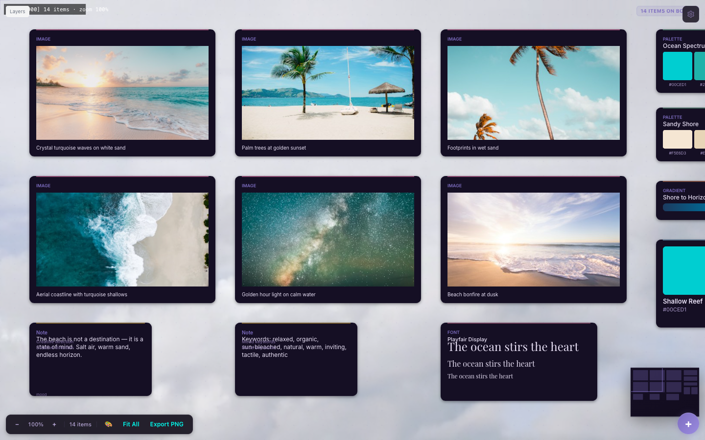

<p align="center">
  
</p>

<h1 align="center">MoodBored</h1>

<p align="center">
  <strong>Visual mood-board workspace where humans and LLMs brainstorm together.</strong><br/>
  <em>Any LLM. Any IDE. One canvas.</em>
</p>

<p align="center">
  <a href="https://moodbored-production.up.railway.app">
    
  </a>
  <a href="#quick-start">
    
  </a>
  <a href="#api-reference">
    
  </a>
  <a href="#features">
    
  </a>
</p>

---

## What is MoodBored?

MoodBored is a **collaborative canvas** for creative direction — mood boards, brand exploration, design systems, and reference gathering. 

**Key Capabilities:**
- 🎨 **Visual Canvas** — Infinite pan/zoom with 13 item types
- 🤖 **AI-Powered** — 14 LLM providers with tool-calling
- 💻 **IDE Features** — File nodes, Monaco editor, Git integration
- 🎓 **Education Mode** — Interactive lessons with quizzes
- 🔗 **Real-time Collaboration** — Multiple users, cursor tracking
- 🚀 **MCP Server** — 20 tools for AI agent integration

**No sign-up required.** Works offline. Runs everywhere.

<p align="center">
  <br/>
  <em>Canvas with video background — images, palettes, gradients, fonts, and notes</em>
</p>

---

## Quick Start

### Web (Recommended)

```bash
git clone https://github.com/xevios-hash/MoodBored.git
cd MoodBored
npm install
npm run dev
```

Open `http://localhost:5173` in your browser.

### Production

```bash
npm run build && npm start
```

Serves at `http://localhost:3000`.

### Desktop (Windows/macOS/Linux)

```bash
npm run tauri build
```

Creates native desktop app with auto-updates.

### AI Bridge (for web access to local models)

```bash
node scripts/ai-bridge.js
```

Runs on port 3001, connects web app to local AI providers.

---

## Features

### 🎨 Canvas & Items

#### 13 Item Types

| Type | Description | Use Case |
|------|-------------|----------|
| `note` | Text thoughts, quotes, keywords | Quick ideas, annotations |
| `text` | Raw content snippet | Longer passages, code |
| `image` | Visual reference | Photos, screenshots, designs |
| `link` | Reference URL | Websites, articles |
| `palette` | Color palette | Brand colors, themes |
| `gradient` | Gradient preview | Color transitions |
| `font` | Typography preview | Font selections |
| `swatch` | Single color | Color samples |
| `sizeguide` | Dimensions reference | Layout planning |
| `video` | Video reference | Motion, animations |
| `container` | Group of items | Organization, folders |
| `web` | Live web page | Interactive references |
| `file` | File on disk | Code, documents |

#### Canvas Features

- **Infinite pan/zoom** — Ctrl+scroll to zoom, drag to pan
- **Lasso selection** — Select multiple items by dragging
- **Alignment snapping** — Items snap to grid and each other
- **Viewport culling** — Handles 500+ items smoothly
- **Video backgrounds** — YouTube, MP4, or solid colors
- **Undo/Redo** — Full history with Ctrl+Z/Ctrl+Shift+Z

<p align="center">
  <br/>
  <em>Dark mode canvas with organized mood board</em>
</p>

---

### 🤖 AI Features

#### 14 AI Providers

| Provider | Type | Models |
|----------|------|--------|
| OpenRouter | Cloud | 100+ models |
| OpenAI | Cloud | GPT-4, GPT-4o, GPT-3.5 |
| Anthropic | Cloud | Claude 3.5, 3 Opus, 3 Haiku |
| Google Gemini | Cloud | Gemini Pro, 1.5 Pro/Flash |
| Groq | Cloud | Llama 3, Mixtral |
| Together AI | Cloud | Llama, Mixtral, CodeLlama |
| Mistral AI | Cloud | Mistral Large/Medium/Small |
| Cohere | Cloud | Command R+, Command R |
| Perplexity | Cloud | Sonar models |
| Fireworks AI | Cloud | Llama, Mixtral |
| DeepSeek | Cloud | DeepSeek Chat, Coder |
| Ollama | Local | llama3, mistral, codellama |
| LM Studio | Local | Any local model |
| Custom | Local | Any OpenAI-compatible |

#### AI Capabilities

- **Canvas Conversations** — Click a note, press Space, AI responds with connected nodes
- **Quick Input** — Press `/` to create nodes with smart type detection
- **Multi-Agent Mode** — 6 specialist roles (Color, Typography, Layout, Content, Visual, Orchestrator)
- **Semantic Search** — Find items by meaning, not just keywords
- **Image Generation** — Generate images via API proxy

<p align="center">
  <br/>
  <em>MCP connection info page — copy-paste configs for any IDE</em>
</p>

---

### 💻 IDE & File System

#### File Nodes

Files on disk become canvas nodes with:
- **Syntax highlighting** — Language auto-detection
- **Monaco Editor** — Full VS Code editing experience
- **Double-click to edit** — Opens editor directly
- **Bidirectional sync** — Changes on disk update canvas

#### Workspace

- **Auto-created** at `~/MoodBored-Workspace`
- **Folder structure** — Containers represent folders
- **Git integration** — Status, commit, log via API

#### File Tools (for AI agents)

| Tool | Description |
|------|-------------|
| `create_file` | Create files on disk |
| `read_file` | Read file contents |
| `update_file` | Modify existing files |
| `list_files` | Browse workspace directory |
| `git_commit` | Commit changes to version control |

---

### 🎓 Education Mode

#### Slideshow Presentation

- **Full-screen slideshow** with AI narration (Web Speech API)
- **Interactive quizzes** — Multiple choice, true/false, fill-in-blank
- **Progress tracking** — Scores, completion, resume where you left off

#### AI Lesson Generation

- **"Teach me about X"** — AI creates complete lessons with slides
- **Grade-level adaptation** — K-2, 3-5, 6-8, 9-12, Adult
- **Auto-generated narration** — Spoken slides with adjustable speed

---

### 🎨 Regions & Organization

- **Regions** — Colored, named boxes for organizing board areas
- **Arrange Tools** — Grid, stack, spiral layouts via right-click menu
- **Presentation Mode** — Convert boards to slideshows with narration
- **Export for AI** — Prompts for SD, Midjourney, DALL-E, video models

---

### 🔧 Model Management

- **Native Model Scanner** — Auto-detects models in common locations
- **Model Catalog** — Browse and download popular models from HuggingFace
- **Runtime Detection** — Finds llama.cpp, Ollama, LM Studio, ComfyUI, Automatic1111, Invoke AI
- **VRAM Estimation** — Estimates memory requirements for each model

---

### 🚀 Inference Orchestration

- **Local Runtime Support** — llama.cpp, Ollama, LM Studio, ComfyUI, Automatic1111, Invoke AI
- **Unified API** — Same interface for local and cloud models
- **Automatic Fallback** — Tries local runtimes first, then cloud
- **Direct Generation** — Send prompts to image generation services

---

## MCP Server

**20 tools** for AI agents:

```
get_board, add_items, remove_items, update_item, search_items,
semantic_search, related_items, arrange_items, clear_board,
open_url, draw_connection, create_snapshot, list_snapshots,
summarize_across, generate_lesson, read_file, write_file,
list_files, delete_file, rename_file
```

### Transport Options

- **Stdio** — Claude Desktop, Cursor
- **SSE** — OpenCode, web IDEs
- **Discovery** — `/.well-known/mcp.json`

### MCP Configuration

```json
{
  "mcpServers": {
    "moodbored": {
      "command": "npx",
      "args": ["tsx", "/path/to/MoodBored/mcp/mcp-server.ts"]
    }
  }
}
```

---

## API Reference

### Board Operations

```
POST   /api/board/:id/items              — Add items
DELETE /api/board/:id/items              — Remove items
PATCH  /api/board/:id/items/:itemId      — Update item
GET    /api/board/:id/search?q=&tag=     — Text search
GET    /api/board/:id/semantic?q=        — Semantic search
POST   /api/board/:id/arrange            — Layout arrangement
GET    /api/board/:id/brief              — Creative brief export
POST   /api/board/:id/lesson             — Generate lesson
GET    /api/board/:id/lesson             — Get lesson data
```

### AI Operations

```
POST   /api/ai/chat                      — AI chat (multi-provider)
GET    /api/ai/providers                 — List available providers
GET    /api/ai/models/:provider          — Scan provider models
GET    /api/ai/status/:provider          — Check provider status
POST   /api/ai/generate-image            — Image generation (proxied)
```

### File Operations

```
POST   /api/files/write                  — Write file to workspace
GET    /api/files/read                   — Read file from workspace
GET    /api/files/list                   — List files in workspace
DELETE /api/files/delete                  — Delete file
POST   /api/files/rename                 — Rename file
GET    /api/workspace                    — Get workspace info
```

### Git Operations

```
GET    /api/git/status                   — Git status
POST   /api/git/commit                   — Commit changes
GET    /api/git/log                      — Commit history
POST   /api/git/init                     — Initialize repository
```

### Agent Operations

```
GET    /api/agents                       — List connected agents
POST   /api/agents/register              — Register agent
GET    /api/operations                   — View operation history
GET    /api/conflicts                    — View conflicts
```

---

## Keyboard Shortcuts

Press `?` for in-app help.

| Key | Action | Key | Action |
|-----|--------|-----|--------|
| `N` | New note | `P` | New palette |
| `T` | New text | `G` | New gradient |
| `I` | New image | `F` | New font |
| `L` | New link | `V` | New video |
| `/` | Quick input | `Space` | AI respond to note |
| `Ctrl+K` | Search | `Ctrl+Z` | Undo |
| `Ctrl+A` | Select all | `Ctrl+Shift+Z` | Redo |
| `Ctrl+C` | Copy | `Ctrl+D` | Duplicate |
| `Ctrl+V` | Paste | `0` | Reset zoom |
| `Delete` | Delete selected | `Escape` | Cancel/deselect |
| Double-click | Create blank card | Right-click | Context menu |
| `Alt+Drag` | Annotate | `?` | Show help |

---

## Contributing

1. Fork the repository
2. Create a feature branch: `git checkout -b feature/amazing-feature`
3. Commit changes: `git commit -m 'Add amazing feature'`
4. Push to branch: `git push origin feature/amazing-feature`
5. Open a Pull Request

### Development Setup

```bash
# Install dependencies
npm install

# Start development server
npm run dev

# Run tests
npm test

# Build for production
npm run build

# Build desktop app
npm run tauri build
```

---

## License

Apache 2.0 - See [LICENSE](LICENSE) for details.

---

<p align="center">
  <strong>Built with ❤️ for the creative community</strong>
</p>