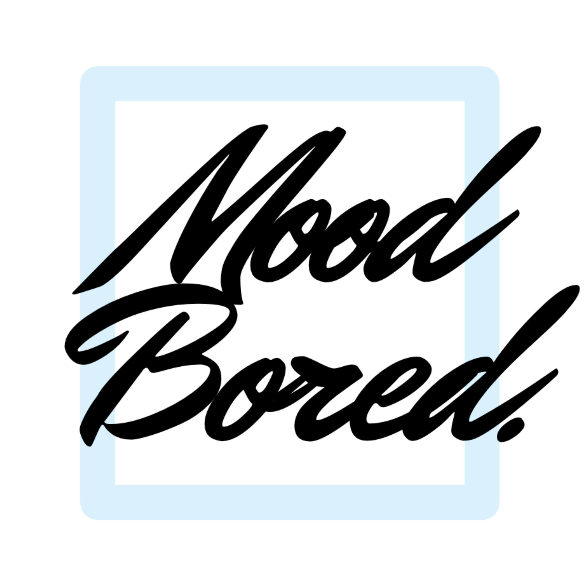
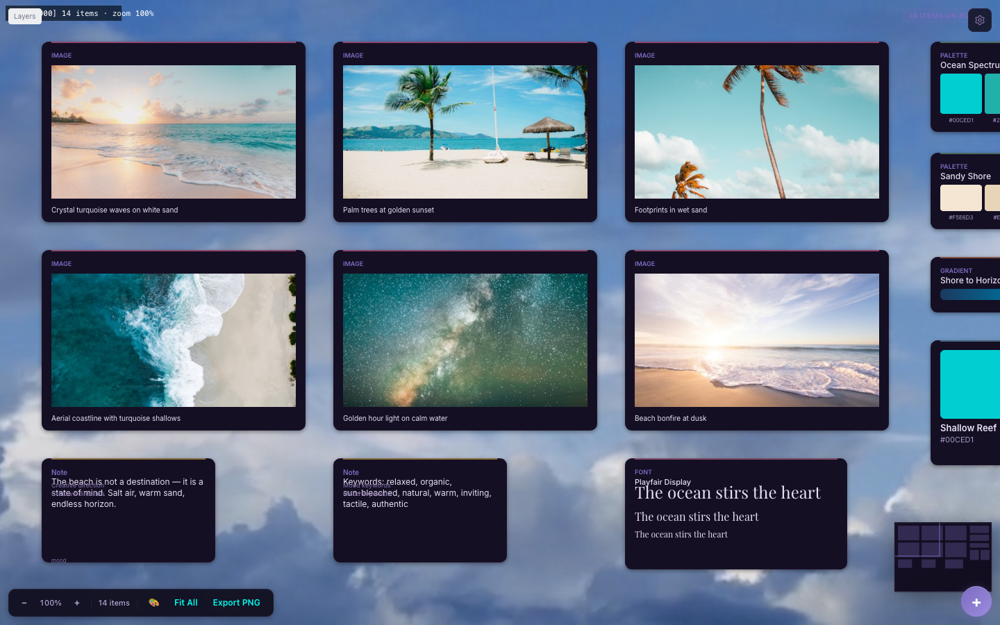
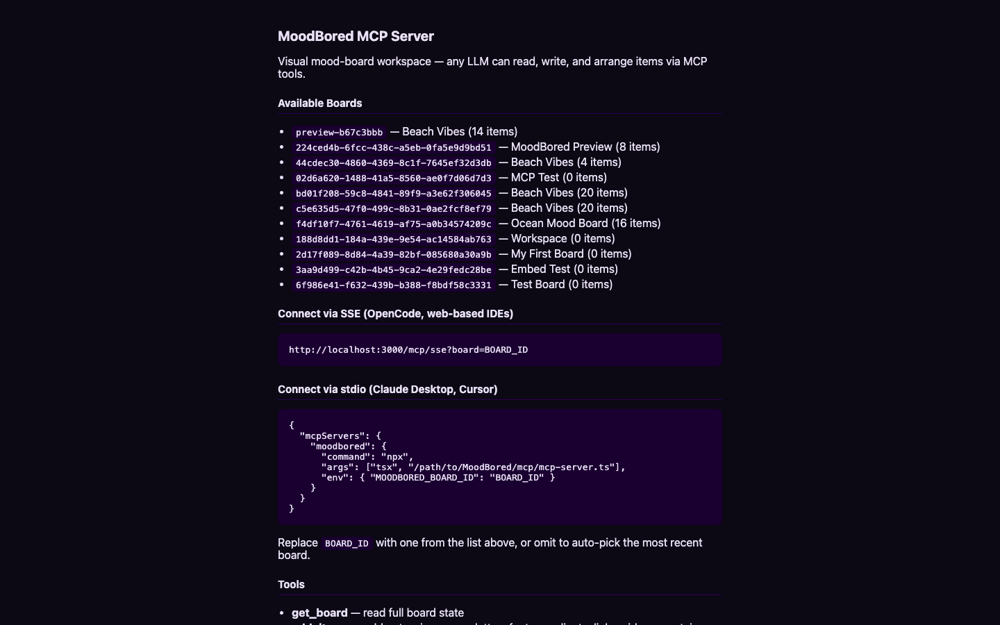

<p align="center">
  
</p>

<h1 align="center">MoodBored</h1>

<p align="center">
  <strong>Visual mood-board workspace where humans and LLMs brainstorm together.</strong><br/>
  <em>Any LLM. Any IDE. One canvas.</em>
</p>

<p align="center">
  <a href="https://moodbored-production.up.railway.app">Live Demo</a> ·
  <a href="#quick-start">Quick Start</a> ·
  <a href="#mcp--rest-api">API</a> ·
  <a href="#features">Features</a> ·
  <a href="#screenshots">Screenshots</a>
</p>

---

## What is MoodBored?

MoodBored is a collaborative canvas for creative direction — mood boards, brand exploration, design systems, and reference gathering. Any LLM can read, write, and arrange items via MCP or REST API. No sign-up required.

**Try it live:** [moodbored-production.up.railway.app](https://moodbored-production.up.railway.app)

## Install & Run

```bash
git clone https://github.com/xevios-hash/MoodBored.git
cd MoodBored
npm install
npm run dev
```

**Production:**
```bash
npm run build && npm start    # serves at http://localhost:3000
```

**macOS desktop:**
```bash
npx tauri build
```

## Screenshots

<p align="center">
  <br/>
  <em>Canvas with video background — images, palettes, gradients, fonts, and notes</em>
</p>

<p align="center">
  <br/>
  <em>MCP connection info page — copy-paste configs for any IDE</em>
</p>

## Features

### New Features (Spatial Browser Workspace)

#### Browser Engine Layer
- **Live web pages on canvas** — each node can host a real embedded browser view via iframes (Tauri WebContentsView on desktop)
- **Tab lifecycle** — create, focus, navigate, reload, close web nodes
- **Session persistence** — cookies and login sessions persist per node
- **Fullscreen focus** — double-click a web node to focus it fullscreen; press Esc or click the back control to return to board view
- **Pan and zoom** — nodes stay positioned and interactive while panning/zooming the board

#### Spatial Tab Management
- **Board IS the tab manager** — no native tab strip; nodes are tabs
- **Typed connections** — draw lines between nodes to represent citations, dependencies, contradictions, or "related to" links
- **Connection types** — citation, dependency, contradiction, related, MCP, API, custom
- **Visual edge types** — MCP and REST API connections render as distinct edge types on the board

#### Blank-Card-First, Multimodal Creation
- **Double-click empty canvas** — creates a blank card (not a note)
- **Type-to-act** — on an empty card: URL loads the site, search query runs a search, sentence becomes a note
- **Drag-and-drop** — text, images, files, and URLs materialize cards of the inferred type
- **Card morphing** — a search result promotes to a full site card on click-through; a note can absorb a dropped link

#### Forward/Back and History
- **Per-card browser history** — back/forward controls scoped to the focused card
- **Board-level undo** — Cmd+Z for every meaningful action: node added, moved, connected, morphed, deleted

#### Snapshots, Versioning, Forking
- **Named snapshots** — save a checkpoint of the entire board state
- **Fork from snapshot** — create a parallel copy for exploration
- **Scrubbable timeline** — opt-in version UI with restore and fork actions

#### AI Co-Pilot on the Board
- **AI can open nodes** — the model can open URLs as live web page cards
- **AI can draw connections** — the model can create typed connections between items
- **Summarize across cards** — AI can summarize content across multiple cards
- **Shared visual context** — the model sees node contents and connections, not just chat text

#### Import from Chrome
- **One-click import** — every open Chrome tab becomes a node on a fresh board
- **Domain grouping** — tabs are laid out by domain for instant organization
- **Chrome DevTools Protocol** — connects to Chrome's debugging port for tab access

#### Data Layer
- **Local graph store** — IndexedDB (browser) / SQLite (Tauri) for nodes, edges, positions, history, and snapshots
- **Typed connections** — schema supports citation, dependency, contradiction, related, MCP, API, custom
- **Multimodal card content** — web, note, search, image, AI, blank card types
- **Version metadata** — snapshots and workspaces with full state preservation

#### Pin and Restore Workspaces
- **Named workspaces** — save a board as a named workspace/project
- **Full restore** — reopening restores sites, notes, connections, and AI context exactly
- **Pin important workspaces** — keep frequently used workspaces at the top

### Canvas
- Infinite pan/zoom with smooth touch gestures (pinch-to-zoom on mobile)
- Lasso selection, alignment snapping, multi-select
- Layers panel, minimap, right-click context menu (all 11 item types)
- Double-click to create notes, click to expand/collapse
- Image URL prompts when adding via toolbar
- Link creation prompts for URL input
- Video/YouTube background support
- Eyedropper color picker (Chrome/Edge)

### 12 Item Types
| Kind | Description |
|------|-------------|
| `note` | Text thoughts, quotes, keywords |
| `text` | Raw content snippet |
| `image` | Visual reference (Unsplash, URLs, uploads) |
| `link` | Reference URL with title and summary |
| `palette` | Color palette with hex codes |
| `gradient` | Gradient preview with stops and direction |
| `font` | Typography preview with sample text |
| `swatch` | Single color with usage notes |
| `sizeguide` | Dimensions and orientation reference |
| `video` | Video reference with subject and motion description |
| `container` | Group of items with layout modes (free/grid/stack) |
| `web` | Live web page with browser controls and navigation history |

### AI
- LLM chat with tool-calling (OpenRouter) — structured function invocations
- Image generation via OpenRouter
- Multi-agent mode (6 specialist roles, toggled off by default)
- Semantic search — find items by meaning, not just keywords
- Related items — find items that complement a given item
- Automatic board population from natural language

### Content Creation
- **Unsplash search** — built-in image browser with one-click add
- **Color picker** — HSL sliders, harmony generators (complementary, analogous, triadic)
- **Palette extraction** — extract dominant colors from canvas pixels
- **Export for Creation** — 8 creation types (image, video, game, web, 3D, audio, document), 3 formats (Markdown, JSON, XML)

### MCP Server
- 14 tools: `get_board`, `add_items`, `remove_items`, `update_item`, `search_items`, `semantic_search`, `related_items`, `arrange_items`, `clear_board`, `open_url`, `draw_connection`, `create_snapshot`, `list_snapshots`, `summarize_across`
- Stdio transport (Claude Desktop, Cursor) + SSE transport (OpenCode, web IDEs)
- `/.well-known/mcp.json` discovery endpoint
- Connection info page at `/mcp`

### REST API
Same tools as MCP, plain HTTP for any client:
```
POST   /api/board/:id/items              — add items
DELETE /api/board/:id/items              — remove items
DELETE /api/board/:id/items/all          — clear board
PATCH  /api/board/:id/items/:itemId      — update item
GET    /api/board/:id/search?q=&tag=     — text search
GET    /api/board/:id/semantic?q=        — semantic search
GET    /api/board/:id/items/:id/related  — related items
POST   /api/board/:id/arrange            — grid/stack/spiral layout
GET    /api/board/:id/brief              — creative brief export
```

### Collaboration
- Share boards via links with view/edit roles
- Real-time presence with cursor tracking
- No sign-up required for viewers
- Anonymous identity ("Blue Penguin" style names)

### Platform
- Web (any browser)
- macOS desktop (Tauri)
- PWA (installable, works offline)
- Railway deployment (Express server + MCP SSE)
- Code splitting (vendor/store/UI chunks)

## MCP & REST API

### Claude Desktop / Cursor (stdio)

```json
{
  "mcpServers": {
    "moodbored": {
      "command": "npx",
      "args": ["tsx", "/path/to/MoodBored/mcp/mcp-server.ts"],
      "env": { "MOODBORED_BOARD_ID": "your-board-id" }
    }
  }
}
```

### OpenCode / Web IDEs (SSE)

```
https://your-domain.com/mcp/sse?board=your-board-id
```

### REST API

```bash
# Create a board
curl -X POST https://your-domain.com/api/boards -H "Content-Type: application/json" -d '{"name":"My Board"}'

# Add items
curl -X POST https://your-domain.com/api/board/BOARD_ID/items \
  -H "Content-Type: application/json" \
  -d '[{"kind":"note","text":"Hello from curl!"},{"kind":"palette","label":"Colors","colors":[{"hex":"#FF6B35","label":"Orange"}]}]'

# Semantic search
curl "https://your-domain.com/api/board/BOARD_ID/semantic?q=warm+coastal+vibes"
```

## Keyboard Shortcuts

| Key | Action | Key | Action |
|-----|--------|-----|--------|
| `N` | New note | `P` | New palette |
| `T` | New text | `G` | New gradient |
| `I` | New image | `F` | New font |
| `L` | New link | `V` | New video |
| `Ctrl+K` | Search | `Ctrl+Z` | Undo |
| `Ctrl+A` | Select all | `Ctrl+Y` | Redo |
| `Ctrl+C` | Copy | `+` / `-` | Zoom in/out |
| `Ctrl+V` | Paste | `0` | Reset zoom |
| `Delete` | Delete selected | `Escape` | Cancel/deselect/unfocus |
| Double-click | Create blank card | Right-click | Context menu |

## License

Apache 2.0